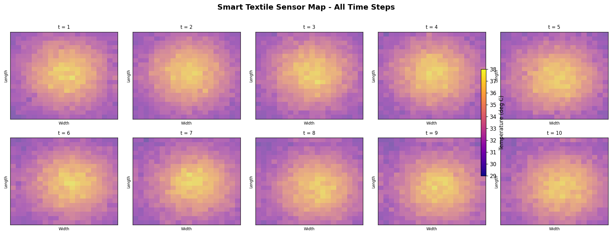

# Smart Textile Sensor Visualization on Virtual Fabric

## Output Example
### Sensor Overview


### Animation
! [Animation](sensor_animation.gif)

## Project Concept
This project simulates a 20x20 smart textile sensor grid to explore temperature and pressure distribution across 
a virtual fabric surface over multiple time steps using Python. The project generates synthetic 
sensor data and visualizes it as heatmaps over a fabric texture.

## Real World Context
Real e-textile systems like those used in medical monitoring vests,
sports compression garments, and military exosuits embed conductive
yarns or PEDOT:PSS-coated fibers as sensors.
The heatmap grid used in this project is conceptually identical to how
researchers visualize data from a real 2D textile sensor array.
The only difference is that in a real system the sensor values would
come via Bluetooth or USB from a microcontroller (Arduino/ESP32)
connected to the textile.

## Features
- Simulation of a 20×20 smart textile sensor grid
- Multiple scenarios: body heat, pressure, uniform
- Fabric texture background for realistic visualization
- Dynamic heatmap animation
- Automatic export of sensor data to CSV

## Libraries Used
- Python
- NumPy
- Pandas
- Matplotlib
- Pillow (PIL)

## How to Run
```bash
python smart_textile.py
```
---
## Cheers to Coding and Exploring Smart Textiles 🧵
